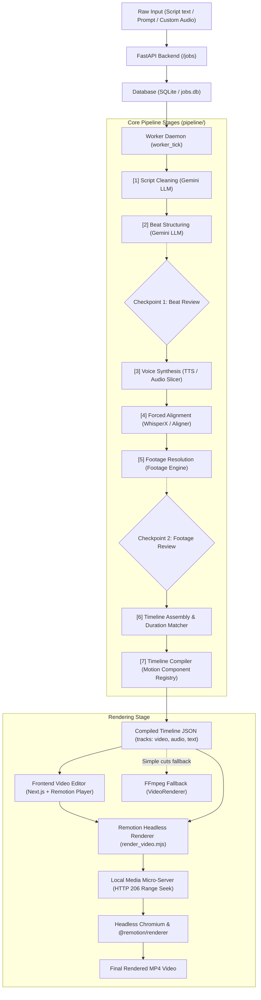

# Video Generation Pipeline Architecture & Workflow

This document details the end-to-end architecture and lifecycle of the video generation pipeline, explaining how a video project progresses from raw text or audio input through to the final rendered MP4 video.

---

## 1. High-Level Architecture

The system consists of two primary codebases working in synergy:
1. **Pipeline Backend & Core Engine (`video-generation-pipeline`)**:
   - **FastAPI REST API (`backend/api/`)**: Manages job creation, state transitions, human checkpoints, and SSE streaming.
   - **Durable Worker Engine (`backend/worker/`)**: Executes stage-by-stage state machine transitions with SQLite persistence.
   - **Core Stages (`pipeline/stages/`)**: LLM script processing, audio synthesis, forced alignment, footage resolution, and timeline assembly.
   - **Timeline Compiler (`backend/compiler/`)**: Translates abstract asset plans into concrete multi-track Remotion timelines.
2. **Video Editor Frontend & Remotion Renderer (`video-generation-frontend`)**:
   - **Next.js Editor UI**: Interactive timeline editor with live canvas preview, clip trimming, layout adjustments, and checkpoint approval modals.
   - **Remotion Render Engine (`scripts/render_video.mjs`)**: Headless Chromium renderer with local micro-server media caching and frame-accurate composition export.



---

## 2. End-to-End Pipeline Stages

### Stage 0: Job Creation & Ingestion
* **Code References**:
  - API Route: [`create_new_job`](backend/api/routes/jobs.py) (`POST /jobs`)
  - DB Model: [`VideoJob`](backend/models/job.py)
* **Inputs Supported**:
  - Raw script text or narrative prompt.
  - Optional custom pre-recorded audio file (`.wav`, `.mp3`).
  - Target orientation (`horizontal` 16:9, `vertical` 9:16, `square` 1:1).
  - Selected TTS engine (`kokoro`, `chatterbox`, `supersonic`, `mock`).
  - Selected Aligner engine (`whisperx`, `easytranscriber`, `mock`).
  - `auto_approve` flag (defaults to `True` for unattended rendering, `False` for human-in-the-loop checkpoints).
* **Storage**: Initial job row is persisted to SQLite (`data/jobs.db`) with `stage=cleaning` and `status=pending`.

---

### Stage 1: Script Cleaning
* **Code Reference**: [`clean_script.py`](pipeline/stages/clean_script.py)
* **Engine**: Google Gemini (`GeminiLLMClient`, `gemini-2.5-flash`).
* **Process**:
  - Strips director directions, camera angles, and footage cues (`[B-roll: ocean waves]`, `[Cut to chart]`).
  - Strips sound effects and music markers (`[SFX: explosion]`, `[Upbeat music]`).
  - Strips presenter labels (`Narrator:`, `Host:`) and markdown headers (`# Scene 1`).
  - Preserves natural conversational spoken prose.

---

### Stage 2: Beat Structuring & Motion Tagging
* **Code Reference**: [`structure_beats.py`](pipeline/stages/structure_beats.py)
* **Engine**: Google Gemini (`GeminiLLMClient`).
* **Process**:
  - Segments clean prose into atomic visual beats (approx 3–7 seconds each).
  - Categorizes each beat into one of **10 visual archetypes**:
    1. **`narrative`**: Storytelling / live-action footage scene.
    2. **`stat`**: Standout metrics, percentages, numbers (`DataAnimations/StatCard`).
    3. **`abstract` / `quote`**: Conceptual quotes or highlights (`TextAnimations/QuoteCard`).
    4. **`swipe_deck`**: Key bullet takeaways or ordered steps (`ListAnimations/SwipeDeck`).
    5. **`chat_bubbles`**: Conversational dialogue / log threads (`ListAnimations/ChatBubbles`).
    6. **`kinetic`**: High-energy dynamic keyword reveals (`TextAnimations/KineticText`).
    7. **`typewriter`**: Mechanical terminal / character exposition (`TextAnimations/Typewriter`).
    8. **`split_screen`**: Side-by-side comparison (`Layouts/SplitScreen`).
    9. **`map_route`**: Travel trajectories or locator pins (`GeoAnimations/MapExplainer`).
    10. **`audio_waveform`**: Podcast / transmission voice feeds (`AudioAnimations/AudioWaveform`).
  - Assigns **`visual_intent`**: Concrete semantic query describing the physical scene.
  - Assigns **`mood`**: Emotional tone (`tense`, `urgent`, `hopeful`, `somber`, `neutral`) used for downstream CSS color grading.
  - Assigns **`layout_recipe`**: Multi-layer recipes such as `stat_over_footage`, `quote_over_footage`, or `split_screen`.
* **Human Checkpoint 1 (Optional)**:
  - If `auto_approve=False`, the job pauses at `status=awaiting_approval`.
  - The frontend displays the beat cards, allowing the user to edit text, visual prompts, or component types, then approve via `POST /jobs/{id}/approve`.

---

### Stage 3: Voiceover Generation (TTS or Custom Audio Slicing)
* **Code References**:
  - TTS Synthesis: [`synthesize_voice.py`](pipeline/stages/synthesize_voice.py)
  - Audio Slicing: [`slicer.py`](pipeline/audio/slicer.py)
  - Providers: [`KokoroTTSProvider`](pipeline/tts/kokoro.py), [`ChatterboxTTSProvider`](pipeline/tts/chatterbox.py), [`SuperSonicTTSProvider`](pipeline/tts/supersonic.py)
* **Process**:
  - **TTS Path**: Iterates through structured beats, synthesizing high-fidelity audio into `output/audio/{job_id}/{beat_id}.wav`.
  - **Custom Audio Path**: When pre-recorded audio was uploaded, forced alignment is run on the full audio against the transcript, slicing the master file into beat-matched audio clips.

---

### Stage 4: Timestamp Extraction & Forced Alignment
* **Code References**:
  - Stage: [`extract_timestamps.py`](pipeline/stages/extract_timestamps.py)
  - Aligners: [`WhisperXAligner`](pipeline/alignment/whisperx.py), [`EasyTranscriberAligner`](pipeline/alignment/easytranscriber.py)
* **Process**:
  - Performs phoneme-to-audio forced alignment between the spoken `.wav` audio and the beat narration text.
  - Extracts exact start and end timestamps for every single word.
  - Generates word-level timings required for karaoke typography, kinetic text reveals, and frame-accurate video cut points.

---

### Stage 5: Footage Resolution
* **Code References**:
  - Stage: [`resolve_footage.py`](pipeline/stages/resolve_footage.py)
  - Resolver: [`FootageResolver`](pipeline/footage/resolver.py)
* **Process**:
  - Queries `footage-engine` using the beat's `visual_intent` filtered by orientation (`horizontal`, `vertical`, `square`).
  - Pure takeover motion graphics bypass footage searching.
  - Multi-layer beats (`stat_over_footage`, `quote_over_footage`) fetch background footage.
  - Returns top-5 candidate chunks (video URL, thumbnail, duration, semantic match score).
* **Human Checkpoint 2 (Optional)**:
  - If `auto_approve=False`, pauses at `status=awaiting_approval`.
  - The frontend lets the user preview video candidates, pick favorites, or upload alternative clips.

---

### Stage 6: Timeline Assembly & Fallback Chains
* **Code References**:
  - Stage: [`assemble_timeline.py`](pipeline/stages/assemble_timeline.py)
  - Matcher: [`plan_beat_assets`](pipeline/assembly/duration_matcher.py)
* **Process**:
  - Matches candidate footage duration with voiceover duration.
  - Applies automated fallback strategies:
    1. **Direct Trim**: Single video chunk trimmed to exact VO duration.
    2. **Multi-clip Concat**: Chains multiple video chunks if one is too short.
    3. **Ken-Burns Image**: Applies cinematic pan/zoom over an image if no video matches.
    4. **Motion Text Takeover**: Falls back to kinetic typography cards if footage is unavailable.
  - Emits `asset_plan` containing layer roles (`background`, `overlay`, `midground`), z-indices, and layout geometries (`split-left`, `corner-tr`, `overlay-lower-third`, `full`).

---

### Stage 7: Timeline Compilation & Motion Component Resolution
* **Code References**:
  - Compiler: [`compile_timeline.py`](backend/compiler/timeline_compiler.py)
  - Registry: [`ComponentRegistry`](backend/components/registry.py)
  - QA: [`qa.py`](backend/compiler/qa.py)
* **Process**:
  - Transforms abstract asset plans into concrete multi-track Remotion timeline JSON:
    - **`video` track**: Sequential footage clips, images, and motion components with extracted props and exact durations in frames.
    - **`text` track**: Kinetic caption objects and subtitle cues.
    - **`audio` track**: Voiceover clips aligned to absolute timestamps.
  - Generates motion QA preview thumbnails.
  - Updates job to `stage=done` and `status=complete`.

---

### Stage 8: Video Rendering

The compiled timeline is rendered into an MP4 video file via two available engines:

#### Engine A: Remotion Native Renderer (Primary / Full Quality)
* **Orchestrator**: [`run_async_render_task`](backend/worker/renderer_task.py)
* **Script**: [`scripts/render_video.mjs`](../video-generation-frontend/scripts/render_video.mjs)
* **Composition Entrypoint**: [`VideoComposition.tsx`](../video-generation-frontend/src/components/editor/VideoComposition.tsx)
* **Workflow**:
  1. **Local Media Micro-Server**: Starts an internal HTTP server on `127.0.0.1` that implements HTTP `206 Partial Content` (Range seek). This is required for headless Chromium to scrub and seek video frames deterministically without buffering failures.
  2. **Asset Pre-caching**: Downloads remote stock videos/images and saves them in `public/cache/media`.
  3. **Webpack Pre-bundling**: Uses `@remotion/bundler` with Tailwind CSS support to create an optimized bundle in `.remotion-bundle`.
  4. **Headless Frame Rendering**: Puppeteer/Chromium executes the composition at specified resolution (720p, 1080p, 4K) and frame rate (24fps / 30fps).
     - Renders multi-layer CSS layouts (`layerGeometry`).
     - Applies CSS sentiment color grading (`duotone-cool`, `duotone-warm`, `duotone-mono`).
     - Executes React motion components (`StatCard`, `QuoteCard`, `KineticText`, etc.).
     - Renders transitions (`FlashTransition`, `GlitchTransition`) with audio SFX.
  5. **Live Progress Tracking**: Remotion logs frame progress (`Rendering frame 120/720 (16%)`). The backend parses this via regex and updates the database, streaming real-time progress via Server-Sent Events (`GET /jobs/{id}/stream`).
  6. **Export**: Outputs finished MP4 (`h264` + `aac`) to `output/rendered/{job_id}.mp4` and serves it over static HTTP.

#### Engine B: Headless FFmpeg Fallback
* **Code Reference**: [`VideoRenderer`](pipeline/renderer/engine.py) / [`render_video.py`](render_video.py)
* **Purpose**: Lightweight fallback for simple sequential cuts when Chromium or Node is unavailable.
* **Safety Guard**: Raises `RenderEngineMismatchError` if the timeline contains motion components or multi-layer overlay layouts, preventing degraded output.

---

## 3. Motion Component Registry Map

Backend Python extractors map 1:1 with Frontend Remotion React components:

| Archetype / Style Key | Backend Component ID | Frontend Component | Purpose |
| :--- | :--- | :--- | :--- |
| `stat` / `stat-callout` | `DataAnimations/StatCard` | `StatCard.tsx` | Standout metrics, percentages, ring/bar charts |
| `abstract` / `quote` | `TextAnimations/QuoteCard` | `QuoteCard.tsx` | Quoted statements, speaker attribution |
| `swipe_deck` | `ListAnimations/SwipeDeck` | `SwipeDeck.tsx` | 3–5 key takeaways swiping sequentially |
| `chat_bubbles` | `ListAnimations/ChatBubbles` | `ChatBubbles.tsx` | Dialogue exchange or notification stream |
| `kinetic` | `TextAnimations/KineticText` | `KineticText.tsx` | High-energy dynamic typography |
| `typewriter` | `TextAnimations/Typewriter` | `Typewriter.tsx` | Character-by-character mechanical text reveal |
| `split_screen` | `Layouts/SplitScreen` | `SplitScreen.tsx` | Side-by-side comparative layout |
| `map_route` | `GeoAnimations/MapExplainer` | `MapExplainer.tsx` | Map routes, flight trajectories, pin callouts |
| `audio_waveform` | `AudioAnimations/AudioWaveform` | `AudioWaveform.tsx` | Equalizer audio reactive wave for quotes/radio |
| `captions` / `kinetic` | `TextAnimations/KineticCaptions` | `KineticCaptions.tsx` | Word-by-word synced subtitle animation |

---

## 4. Execution & Operating Modes

### 1. Web Application & Full UI Mode
Run backend and frontend concurrently:
```bash
# Terminal 1: Backend API with embedded worker
python server.py

# Terminal 2: Next.js Frontend
cd ../video-generation-frontend
npm run dev
```
Navigate to `http://localhost:3000` to create, review checkpoints, edit clips, and export.

### 2. Autonomous CLI Pipeline Execution
Run the full 6-stage pipeline to generate a timeline JSON:
```bash
python run_pipeline.py --script "Your narration script here" --out output/timeline.json
```

### 3. CLI Remotion Video Export
Render an existing timeline or database Job directly to an MP4 video:
```bash
# Render from timeline JSON
python render_job.py --timeline output/timeline.json --out output/final_video.mp4

# Render from database Job UUID
python render_job.py --job-id <JOB_UUID> --out output/final_video.mp4
```
